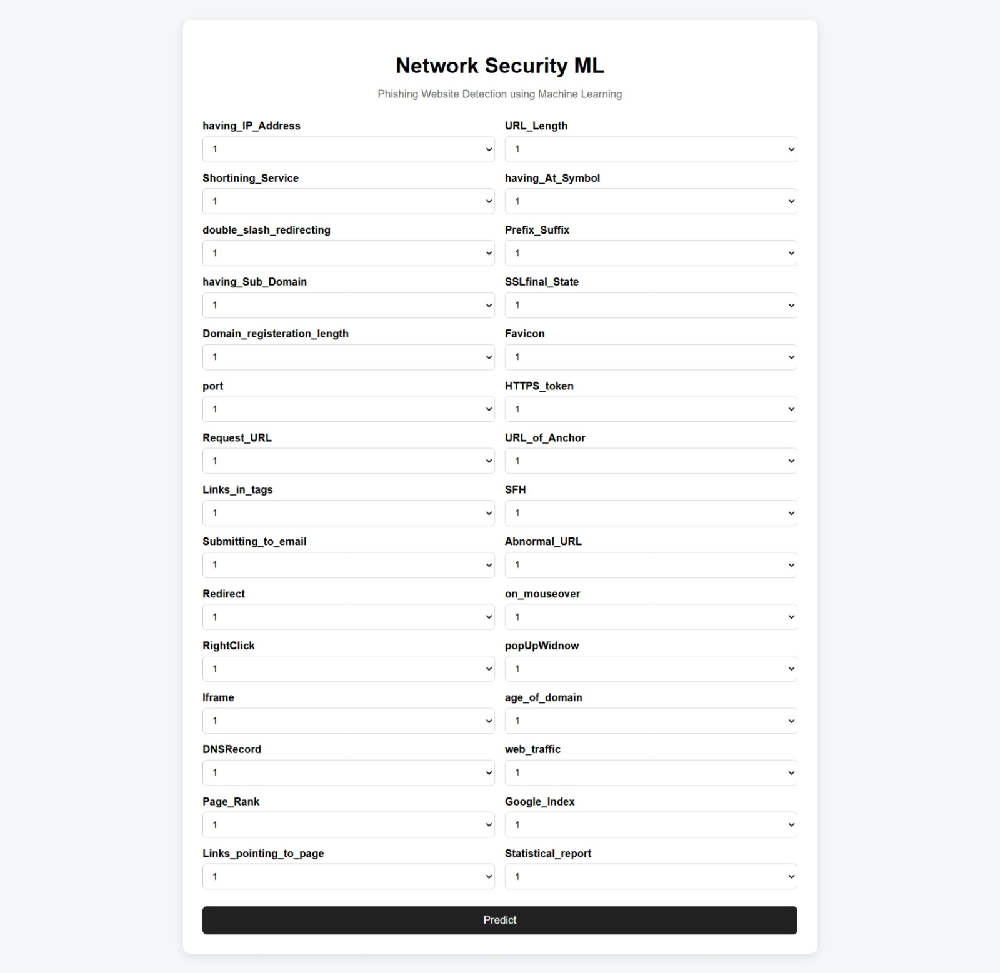
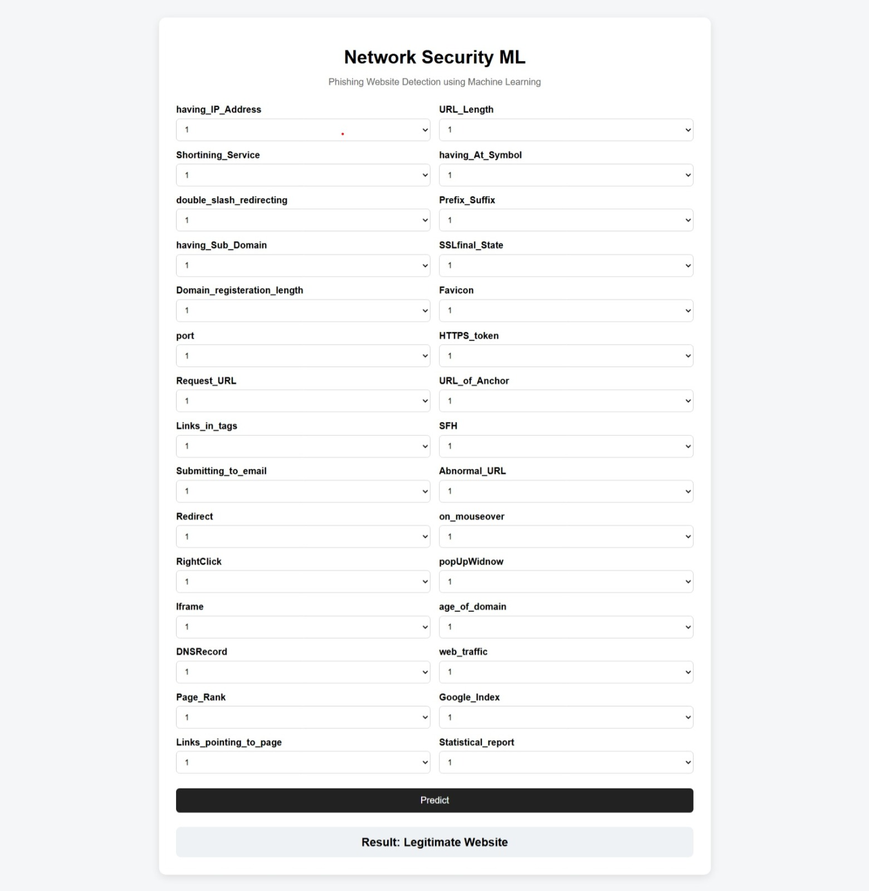

# Network Security ML

## 1. Project Overview

Network Security ML is a machine learning project designed to classify websites as **legitimate or phishing** based on website-related security features.

The project includes a complete machine learning pipeline for data ingestion, validation, transformation, model training, evaluation, and prediction.

It also provides an interactive **Flask web application** where users can enter website feature values and receive a prediction.

---

## 2. Tech Stack

- **Python**
- **Pandas** – Data processing
- **NumPy** – Numerical operations
- **Scikit-learn** – Machine learning
- **Random Forest Classifier** – Classification model
- **Flask** – Web application
- **PyYAML** – Configuration management
- **Joblib** – Model saving and loading
- **Git & GitHub** – Version control

---

## 3. Key Features

- Detects whether a website is likely to be legitimate or phishing.
- Uses 30 website-related security features for prediction.
- Includes data validation and preprocessing pipelines.
- Trains and evaluates a machine learning classification model.
- Saves the trained model for later predictions.
- Provides an interactive Flask web interface.
- Supports command-line and web-based predictions.
- Includes reproducible project setup using Git and GitHub.

---

## 4. Machine Learning Model

The project uses a **Random Forest Classifier** for website classification.

The model learns patterns from website-related security features and predicts the classification of a website.

### Model Performance

- **Test Accuracy:** 96.70%
- **Task:** Binary Classification
- **Prediction:** Legitimate Website / Phishing Website

---

## 5. Project Structure

```text
network-security-ml/
│
├── src/
│   └── networksecurity/
│       ├── components/
│       ├── pipeline/
│       ├── entity/
│       ├── configuration/
│       └── utils/
│
├── data_schema/
│   └── schema.yaml
│
├── templates/
│   └── index.html
│
├── screenshots/
│   ├── web-interface.png
│   └── prediction-result.png
│
├── Artifacts/
├── app.py
├── setup.py
├── requirements.txt
└── README.md

## 6. How It Works

The project follows a machine learning pipeline:

1. **Data Ingestion** – Loads the website dataset.
2. **Data Validation** – Validates the dataset using the defined schema.
3. **Data Transformation** – Prepares the data for machine learning.
4. **Model Training** – Trains the Random Forest classification model.
5. **Model Evaluation** – Evaluates the trained model using test data.
6. **Prediction** – Uses the trained model to classify website features.
7. **Web Interface** – Provides a Flask-based interface for interactive predictions.

---

## 7. Prediction

The application accepts website-related feature values.

Allowed values are:

-1, 0, or 1

The model then produces a prediction.

Example:

Prediction: 1
Result: Legitimate website

The web application provides the same prediction functionality through an interactive interface.

---

## 8. Web Application

The project includes a Flask-based web interface for entering website features and generating predictions.

### Web Interface



### Prediction Result



---

## 9. Future Improvements

- Improve model performance through additional feature engineering.
- Experiment with other machine learning algorithms.
- Add more comprehensive model evaluation metrics.
- Deploy the Flask application online.
- Add automated testing.
- Improve input validation and user interface design.

---

## 10. Learning Outcomes

Through this project, I practiced:

- Python programming
- Machine learning workflows
- Data preprocessing and validation
- Model training and evaluation
- Flask web development
- Git and GitHub version control
- Project structuring
- Reproducible project setup

---

## 11. Installation and Usage

### Clone the Repository

```bash
git clone https://github.com/skhumera0202/network-security-ml.git
cd network-security-ml

Create a Virtual Environment:
python -m venv venv

Activate the Virtual Environment:
Windows PowerShell:

.\venv\Scripts\Activate.ps1

Install Dependencies:
pip install -r requirements.txt

Install the Project:
pip install -e .

Run the Training Pipeline:
python -m networksecurity.pipeline.training

Run the Prediction Pipeline:
python -m networksecurity.pipeline.prediction

Run the Flask Web Application:
python app.py

Then open:

http://127.0.0.1:5000

## 12. Author

**Humera Shaikh**

GitHub: https://github.com/skhumera0202